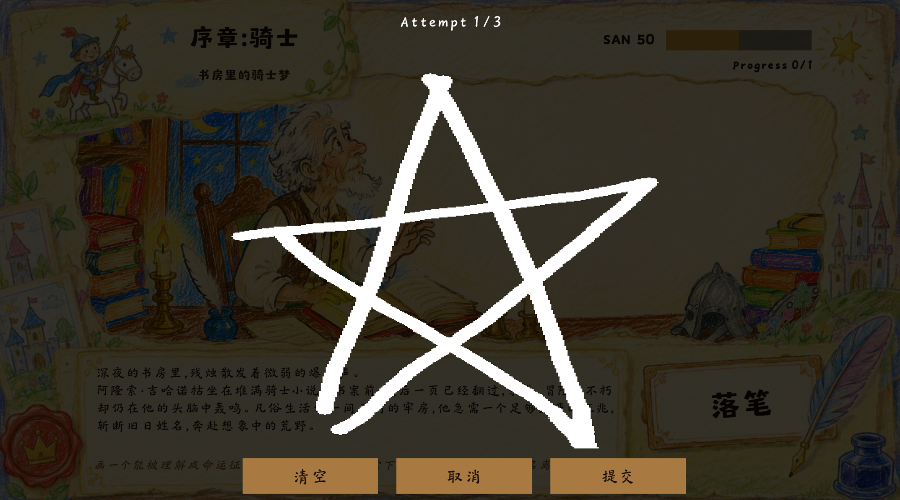

# 《堂吉诃德的旅途》

## 游戏简介

《堂吉诃德的旅途》是一款 AI 叙事绘画冒险游戏，改编自塞万提斯的经典小说《堂吉诃德》。

玩家将进入一本被重新打开的骑士小说，陪伴堂吉诃德踏上荒唐、勇敢、温柔又危险的旅程。每一章故事都会出现新的困境：风车的木翼即将落下，羊群被误认为军团，铜盆被视作传说中的头盔，公爵的恶作剧正在搭起舞台。玩家需要在画布上画下一个能够帮助他的事物，让这场冒险继续向前。

你的画会被识别、理解、嵌入故事，并影响堂吉诃德接下来的命运。

## 核心体验

- 阅读《堂吉诃德》经典章节改编的互动剧情。
- 根据章节目标画下一个能够提供帮助的事物。
- 让 AI 识别你的画作，并判断它能否推动故事。
- 观看你的画作出现在章节插画中。
- 看到 AI 将你的涂鸦转化为更贴合绘本风格的插图。
- 在现实与幻想之间影响堂吉诃德的精神状态，并抵达不同结局。

## 玩法说明

每一章开始时，游戏会展示当前剧情和目标。目标通常围绕“帮助堂吉诃德完成某件事”展开，例如避开风车、平息混乱、完成仪式、保留尊严、摆脱骗局。

玩家需要在画布上画出一个具有功能或象征意义的事物。它可以是一件工具、一种信号、一处出口，也可以是一种能被堂吉诃德理解为奇迹的存在。

提交画作后，AI 会结合章节剧情、目标、识别结果和当前状态进行判定。成功的画作会推动章节前进，失败的画作也会形成新的叙事反馈，使故事朝更清醒或更疯狂的方向倾斜。

## 故事章节

游戏包含序章、上卷、下卷和最终章节，玩家将依次经历堂吉诃德旅途中具有代表性的片段：

- 书房里的骑士梦
- 风车巨人
- 羊群军团
- 曼布里诺的头盔
- 释放囚徒
- 公爵的剧场
- 杜尔西内娅的影子
- 白月骑士决斗
- 未完成的授勋

章节之间穿插过渡插画与叙事段落，让堂吉诃德的旅程从书房延伸到荒野，再走向被观看、被嘲笑、被挑战的最后旅途。

## AI 参与故事

游戏使用本地绘画识别模型理解玩家画作，再由 PlayKit AI 进行叙事判定和图像生成。

本地识别会先判断玩家画下的事物类别。随后，AI 会根据章节目标理解这幅画在故事中的意义：它能否挡住危险，能否打开退路，能否完成仪式，能否让堂吉诃德保住信念，能否让他从一场误认中离开。

在部分章节中，玩家的画作会被嵌入到当前插画场景里。AI 生成的图像会沿着童话绘本与手绘纸张的美术风格，将玩家的涂鸦变成故事画面中的道具、征兆或奇迹。

## 精神状态与结局

堂吉诃德的旅途始终在现实与幻想之间摆动。玩家的每一次落笔都会影响他的精神状态，也会改变故事最终抵达的方向。

游戏包含多种结局：

- 清醒幻灭
- 永恒疯狂
- 故事断章
- 无尽旅途

不同结局代表堂吉诃德对现实、幻想、失败和骑士信念的不同回应。

## 美术风格

游戏采用手绘绘本风格，画面带有羊皮纸、彩铅、童话插画和古典冒险书页的质感。大幅横向插画承载每个章节的主要场景，玩家画作会被放入云层、荒原、剧场、决斗现场、客店庭院等位置，像被写进书页边缘的一次新注脚。

整体视觉希望保留《堂吉诃德》的荒诞感、浪漫感与淡淡的哀伤：风车可以像巨人，铜盆可以像头盔，失败也可以留下骑士继续前行的理由。

## 推荐给喜欢这些体验的玩家

- 喜欢文学改编与互动叙事。
- 喜欢绘画、涂鸦和轻量创作。
- 喜欢 AI 参与故事生成的游戏形式。
- 喜欢童话绘本、荒诞冒险和带有寓言气质的作品。
- 喜欢在短篇流程中体验多结局走向。

## 你所要做的

画下你心中所想，帮助堂吉诃德完成一场或荒唐、或疯狂、没有遗憾的冒险。
